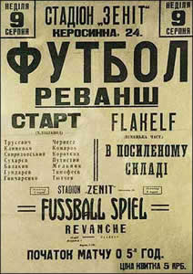
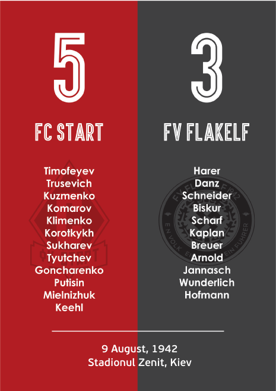
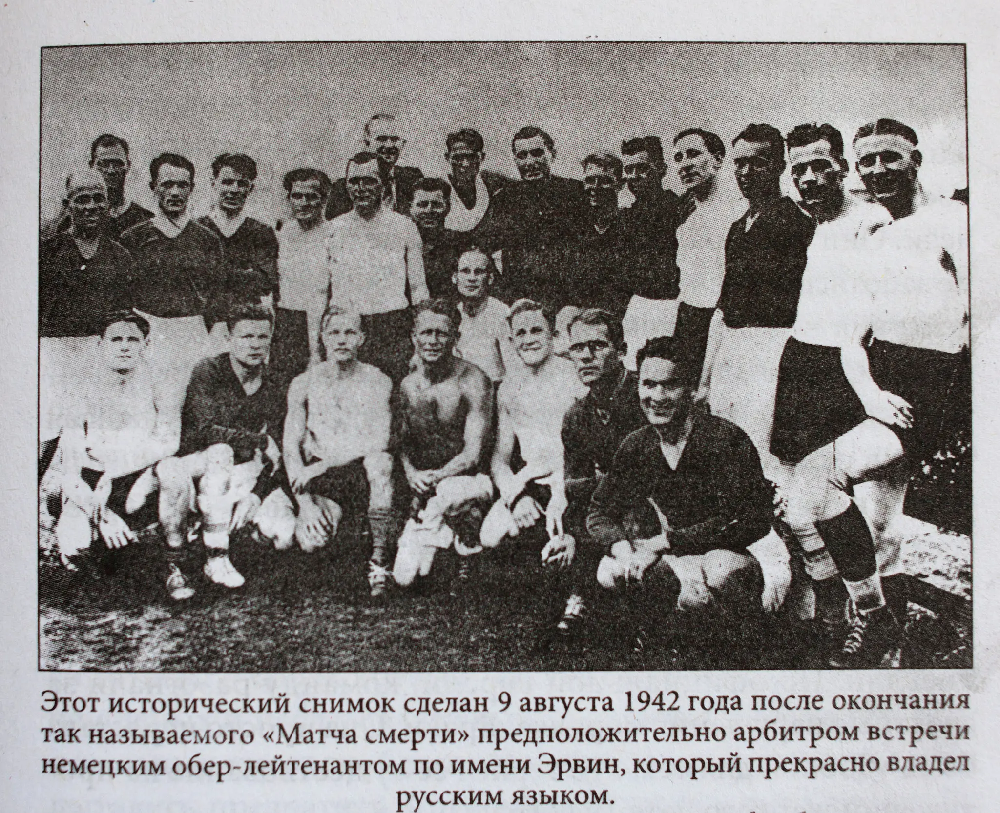
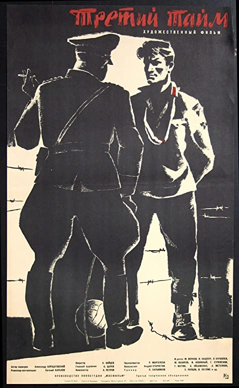
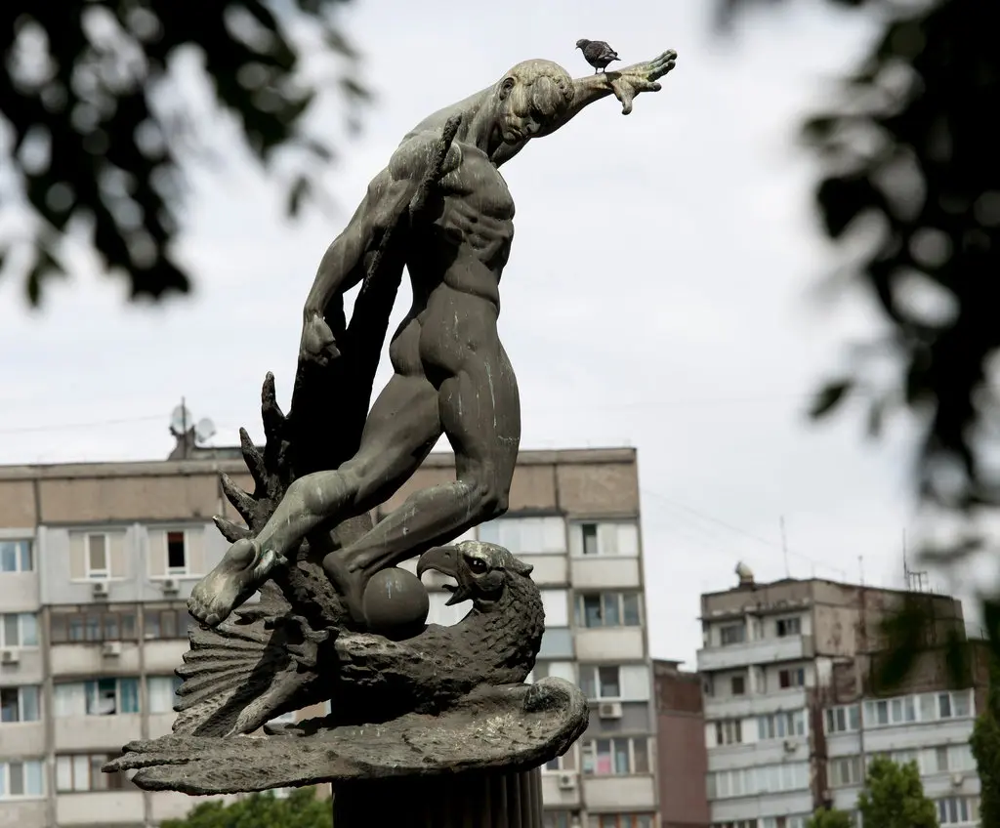

# The Death Match 1942: Football as a Propaganda Tool for WWII and Cold War

### By Yuqi Hu

##### February. 28 2022 Updated 3:05 PM PST

​	Roughly 2 days after Russia started the war against Ukraine, FA announced that "England and Wales will not play Russia in football matches at any level 'for the foreseeable future'" ^[1]^ in solidarity with Ukraine. Despite the current hostile relationship between Russia and Ukraine, both countries were once part of the USSR. 80 years ago, in World War II, Kiev, USSR (Kyiv, Ukraine), was then occupied by Nazi Germany ^[2]^. 

  <i>Poster for the match<i> [4]

​	For the propaganda of the supreme of the Aryan race, on August 9, 1942, in Zenit Stadium controlled by Nazi Germany, a football match was held between German armed forces team -- FV Flakelf and an abused Soviet Ukrainian team -- FC Start ^[3]^. The game ended as 5:3 FC Start to FV Flakelf ^[3][4][5]^; however, these honored winning team players died soon after the game ended without any clear evidence ^[5]^, but people still believe that it was the Nazis who tortured and executed them ^[3]^. Later this match is referred to be 'The Death Match'. 

  <i>Modern remake of the match report<i> [6]

​	In late 1943, when the USSR liberated Kiev, fragments implying the Death Match began to appear in newspapers even though no primary sources can be applied to confirm the fragments belong to the Death Match, but people tended to believe the myth ^[9]^. "If you can’t silence the story, then you have to tell it so that it’s going to get the maximum political advantage," says Tetiana Bykova, a historian at the Ukrainian Academy of Sciences who studies on the match ^[9]^. In the late 1950s, an article called *The Final Duel* was published in Kiev newspaper ^[9]^, so the propaganda of the propaganda machine of the USSR made the Kyiv 11 players be heroes and legends, medals were posthumously awarded ^[7]^. The gap between the real match and the former propaganda can be explained by the concern of possible collaboration between the Nazis and the FC Start players ^[9]^ because it is hard to tell from the picture taken after the match. Even though, the rumors and myths would still greatly encourage the resistance to Fascism. 

  <i>Picture of German and Ukrainian players, but its source is conflicted.<i> [9]

​	In 1962, the story was adapted into an 88-minute movie, *The Third Half* (Tretiy Taym), directed by Yevgeni Karelov ^[7][8]^. In the film, FC Start was required to be lost by a Nazi officer during the halftime; nevertheless, the team mostly made up of former FC Dynamo players refused to obey. One week after the game, Nazi soldiers forced the FC Start players to admit they were agents of the USSR, and then the players were sent to Nazi concentration camps and executed. Through the film, some rumors of the Death Match were revealed. Compared to previously mentioned evidence, some of the plots were largely dramatized, but the theatric rumor coincided with the propaganda needs for ongoing Cold Wat at that time. 

  <i>Poster of the third half<i> [8]

​	However, with more research on the Death Match, scholars found that the historical fact is different from the propaganda media, further demonstrating that the media resource is more for political purposes. According to Sachar Butyrsky, a Ukrainian journalist, some of the hero players were actually still alive after WWII ^[7]^.

> "Few surviving players were ignored and forgotten. They destroyed the hero mythology. Until perestroika, it was not acceptable to get to the facts of the matter. The propaganda image of the evil Germans was needed during the Cold War. ^[7]^"

The sculptures nowadays in front of the Dynamo Stadium in Kyiv can assert that these players were once memorized as national heroes and maybe deified. Moreover, the USSR novelist Anatoly Kuznetsov unrevealed the myth of the Death Match in his book *Babi Yar*. Not only his book was banned, but also he was exiled ^[10]^ by the Soviet government.

  <i>Sculptures in front of the Dynamo Stadium<i> [9]

​	For political purposes, football was used not only for anti-fascism but also for fascist propaganda. In the 1934 World Cup, Nazi Germany won 3rd place, and Axis Italy won first place ^[11]^, projecting fascism abroad. 2 years later, Italy again won the football Gold Medal in Nazi 1936 Summer Olympics ^[12]^. Benito Mussolini proposed making Italy great again with football. Fascists even attempted to change the origin of the football in popular language from British to Italy ^[13]^. However, after the corruption of the Mussolini government in 1943, the fascist propaganda of football in Italy ended, so stopped the use of those Italianized football jargon ^[13]^. Similarly, with the dissolution of the USSR in 1991, the propaganda purpose of the Death Match terminated. Even though the Death Match was twice utilized as a political propaganda tool, it has already evolved into a culture that embodies the eternal patriotism and resistance to oppression from the core of football.

### References

[1] “England Will Not Play against Russia for 'Foreseeable Future' Due to Invasion of Ukraine, FA Confirms.” Sky Sports. Sky Sports, February 27, 2022. https://www.skysports.com/football/news/33694/12553638/england-will-not-play-against-russia-for-foreseeable-future-due-to-invasion-of-ukraine-fa-confirms. 

[2] “Occupation of Kiev.” United States holocaust memorial museum. United States Holocaust Memorial Museum. Accessed February 27, 2022. https://www.ushmm.org/learn/timeline-of-events/1939-1941/occupation-of-kiev. 

[3] Wilkes, Jonny. “Did Nazis Guards Really Play a 'Death Match' against a Ukrainian Football Team?” HistoryExtra. BBC History, January 14, 2022. https://www.historyextra.com/period/second-world-war/did-nazi-organise-football-death-match-ukranian-hungarian-prisoners/. 

[4] Wilkes, Jonny. “Did Nazis Guards Really Play a 'Death Match' against a Ukrainian Football Team?” HistoryExtra. BBC History, January 14, 2022. https://www.historyextra.com/period/second-world-war/did-nazi-organise-football-death-match-ukranian-hungarian-prisoners/. 

[5] Ryabov, Vladislav. “The Death Match of 1942.” These Football Times, March 27, 2018. https://thesefootballtimes.co/2015/11/02/the-death-match-of-1942/. 

[6] Fotbalpemaidan. “Fotbalpemaidan.” Generatia cu mingea pe maidan, February 1, 2019. https://fotbalpemaidan.wordpress.com/author/fotbalpemaidan/. 

[7] Bowen, Kate. “Death Match in the Shadow of War.” DW.COM. Accessed February 27, 2022. https://www.dw.com/en/death-match-in-the-shadow-of-war/a-16000159. 

[8] “Tretiy Taym.” IMDb. IMDb.com, October 24, 1964. https://www.imdb.com/title/tt0056615/. 

[9] Longman, Jeré, and Andrew W. Lehren. “World War II Soccer Match Echoes Through Time.” The New York Times. The New York Times, June 23, 2012. https://www.nytimes.com/2012/06/24/sports/soccer/a-soccer-match-in-ukraine-during-world-war-ii-echoes-through-time.html. 

[10] Riordan, James. "The match of death: Kiev, 9 August 1942." *Soccer & Society* 4, no. 1 (2003): 87-93.

[11] “1934 FIFA World Cup Italy™.” FIFA/UEFA suspend Russian clubs and national teams from all competitions. Accessed February 28, 2022. https://www.fifa.com/tournaments/mens/worldcup/1934italy. 

[12] “Olympic Football Tournament Berlin 1936.” FIFA/UEFA suspend Russian clubs and national teams from all competitions. Accessed February 28, 2022. https://www.fifa.com/tournaments/mens/mensolympic/berlin1936. 

[13] O'Connor-Simpson, Matt. “The Fascists Defile the Beautiful Game: How Mussolini Used Club Football as Propaganda.” Tale of Two Halves, September 14, 2019. https://taleoftwohalves.uk/featured/fascists-defile-beautiful-game-mussolini-used-club-football-propaganda. 