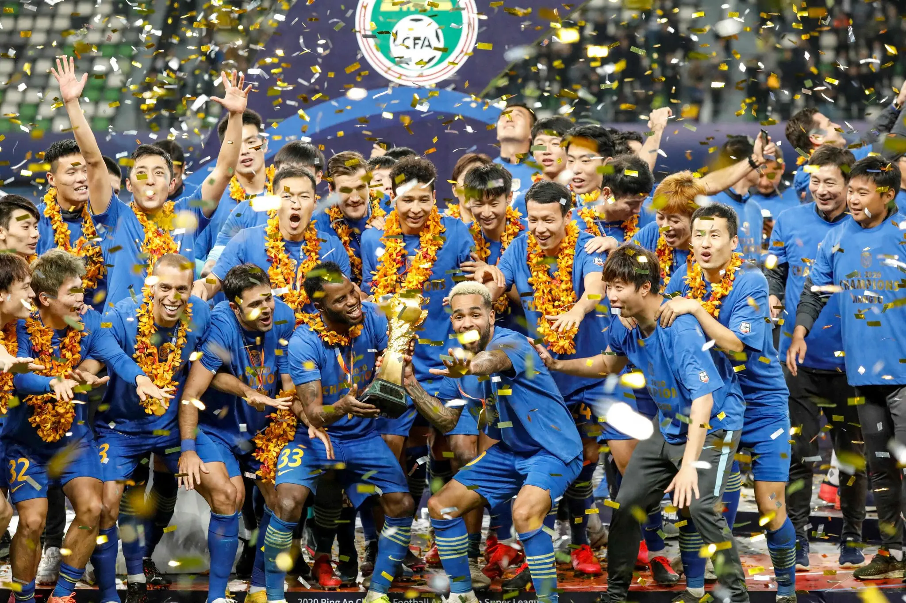

# Impacts of COVID-19 Pandemic on Soccer Games

### By Yuqi Hu

##### May. 1 2022 Updated 2:00PM PST

​	Coronavirus Disease 2019 (COVID-19) swept the world in late 2019. Many industries around the world have been impacted by this virus, and so is soccer. Although the regulations or laws made to stop the spreading varied from place to place, the main point is to reduce physical contact and crowd gathering. Due to these COVID-19 prevention methods, professional soccer games also modified to adapt to the pandemic.

  <i>Jiangsu Suning F.C.: From Chinese champions to vaporized club in less than four months.<i> [5]

​	"The Chinese Super League was originally scheduled to start on April 23 [2022] [...] and the game will be postponed, ^[1]^" according to *Beijing Daily*. This is not the first time the soccer game is delayed because of the COVID-19 in China. In 2021 and 2020, due to extreme serious COVID regulation rules in China, the contemporary season of the Chinese Super League was postponed several times. The schedule of soccer games is greatly impacted not only in China but also in various countries around the world. Results provided by Google via searching "soccer game postponed due to COVID-19" show that Premier Leangue ^[2]^, U.S. Soccer ^[3]^,  UEFA ^[4]^, etc, all rescheduled or canceled games due to COVID in the last two years. Such suspensions and cancelations may directly or indirectly lead to a huge amount of economical losses. The main sources of revenue for the major leagues are nothing but advertising sponsorship, spectators buying tickets, and broadcasting fees; also, many clubs have no stable source of advertising sponsorship because they are unable to play for a long period. Both leagues and clubs could lose their cash flow at any time due to suspension. Since clubs are smaller businesses compared to a league, they are the first who suffer from bankruptcy or dissolution. In China, the main income of a soccer club is usually sponsorship from a rich company that utilizes the club as an advertising tool. Due to COVID-19, the retailer and real estate industries shrunk and recessed; as a result, many soccer clubs could not afford the salary of players so they are dissolved. For instance, Jiangsu Suning FC won the champions of the Chinese Super League, but 4 months later, due to Suning Inc., the sponsor of the club, lack of cash flow in its main retailing business, the club is permanently shut down ^[5]^. The lack of past champion club resulted in fewer Suning FC fans continuing to pay attention to the League, which further negatively affect the Chinese Super League.

  
  

<table border="none">
  <tr>
    <td align="left" border="none" width="49%"><i>Empty Jiangsu Suning FC training center after shutting down.<i> [5]</td>
    <td align="left" border="none" width="49%"><i>Shot on the way to my intern company after the FC closed.<i></td>
  </tr>
</table>

​	An integral part of soccer is the fan culture, but due to the restrictions of COVID-19, many games were played without fans. The pro of doing so obviously has the cutoff of the virus spreading. In addition, according to Chelsea striker Olivier Giroud, 

> "And at least the managers are happy because now we can hear easily everything they tell us, even when they don't shout!. ^[6]^"

To the cons, Giroud added that it is strange to play without fans, and he feels the stadium is larger than he thought ^[6]^. Therefore, the players have to accommodate the new environment. To simulate a conventional gaming atmosphere, some match holders even put fake fans in the stadium, even though such improvements might be worse problems. In the case of FC Seoul, the club put 20 sex dolls with their team jerseys or T-shirts on as fake fans inside Seoul World Cup Stadium, and finally got fined approximately $81,000 by the K-League ^[7]^. Link and Anzer conducted a thorough research on how the empty stadium affects match performance ^[8]^. They analyzed the performance data of Bundesliga (BL) and Bundesliga 2 (BL2) before and after the COVID shutdown, and concluded that

> "pressure on pass receiver: -8.6%, success of attacking duels: -7.9%, share of long passes completed: + 15.6%, outplayed opponents per pass: -14.7%. ^[8]^"

Also, players share less contacting time per match as the games restart, and empty-stadium condition reduce home advantage and decrease referee bias ^[8]^. The research result is interesting and explanative enough for the style change of teams in soccer games during the pandemic.

  
  

<table border="none">
  <tr>
    <td align="left" border="none" width="49%"><i>Chelsea's win over Manchester City on June 25 was a superb game, one that confirmed the Premier League title for Liverpool, but the players are still coming to grips with the silence around them during matches.<i>[6]</td>
      <td align="left" border="none" width="49%"><i>Leeds United’s Jack Harrison celebrates scoring the team’s third goal during the match vs. Fulham.<i>[7]</td>
  </tr>
</table>

​		Last but not least, those big moments in the history of soccer always reflect the history of politics and society ^[9]^. Given these changes that happened to the soccer games in the last two years, historians in the future can infer how widely and severely COVID-19 to us in the early 2020s. The impacts of COVID-19 on soccer games are far less than those impacts on us individuals. Match suspensions and lack of fans are just the epitomes of unemployment and enforced social distance regulations. Even if we had hard times, soccer as a culture provided us with mental support when we were bored in a lockdown. Therefore, studying the changes in soccer is interesting and meaningful.

### References

[1] Chen, S. (2022, April 3). *The start of the new Chinese Super League season will be postponed*. cctv.com. Retrieved April 29, 2022, from https://news.cctv.com/2022/04/03/ARTIRHOReqa0D9zXOyJiwRrQ220403.shtml 

[2] CNN Sport staff. (2021, December 16). *Fifth English Premier League game postponed due to covid-19 outbreak*. CNN. Retrieved April 29, 2022, from https://www.cnn.com/2021/12/16/football/premier-league-postponed-covid-outbreak-spt-intl/index.html 

[3] ussoccer.com. (2020, March 12). *U.S. soccer cancels upcoming men's and women's senior national team matches in March and April due to covid-19 outbreak*. US Soccer. Sponsored by Volkswagen. Retrieved April 29, 2022, from https://www.ussoccer.com/stories/2020/03/us-soccer-cancels-upcoming-senior-national-team-matches-in-march-and-april-due-to-covid19 

[4] Reuters. (2021, November 28). *Portugal league match abandoned as Covid outbreak reduces Belenenses to nine players, including two Keepers*. ESPN. Retrieved April 30, 2022, from https://www.espn.com/soccer/portuguese-liga/story/4532864/portugal-league-match-abandoned-as-covid-outbreak-reduces-belenenses-to-nine-playerstwo-keepers 

[5] Panja, T. (2021, October 11). *Is China's soccer boom going bust?* The New York Times. Retrieved April 29, 2022, from https://www.nytimes.com/2021/10/11/sports/soccer/china-soccer-evergrande.html 

[6] Olley, J. (2020, June 30). *Premier League games with no fans: How players, coaches cope with the silence*. ESPN. Retrieved May 1, 2022, from https://www.espn.com/soccer/english-premier-league/story/4122080/premier-league-games-with-no-fans-how-playerscoaches-cope-with-the-silence 

[7] Moriello, J. (2020, June 28). *Fake fans in the stands are causing real problems for teams*. Sportscasting. Retrieved May 1, 2022, from https://www.sportscasting.com/fake-fans-in-the-stands-are-causing-real-problems-for-teams/ 

[8] Link, D., & Anzer, G. (2022). How the COVID-19 pandemic has changed the game of soccer. *International Journal of Sports Medicine*, *43*(01), 83-93.

[9] Bandyopadhyay, K., & Naha, S. (2019). Defining moments in the history of soccer. *Soccer & Society*, *20*(7-8), 897-902.
